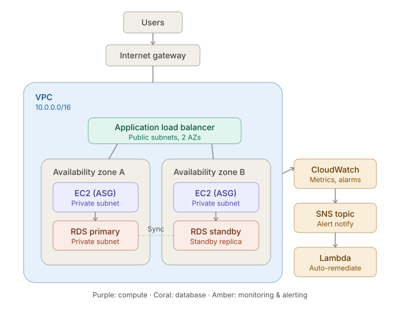

# Self-healing, observable AWS infrastructure platform

A highly-available 3-tier AWS environment, provisioned entirely with Terraform,
with automated failure detection and a documented, tested recovery process.

## Why this project exists

Built to demonstrate practical AWS operations skills — infrastructure as code,
monitoring, incident response, and cost awareness — for cloud support,
infrastructure, sysadmin, and cloud ops roles.

## Architecture



- VPC spanning 2 Availability Zones
- Public subnets: Application Load Balancer
- Private subnets: EC2 instances in an Auto Scaling Group
- RDS in Multi-AZ configuration (primary + standby)
- CloudWatch alarms → SNS → Lambda auto-remediation
- IAM least-privilege roles, Secrets Manager, GuardDuty enabled

## Repo structure

```
terraform/    Infrastructure as code (VPC, compute, database, monitoring)
runbooks/     Incident response documentation from simulated failures
diagrams/     Architecture diagrams
screenshots/  Console/CLI evidence of the running system
```

## Status

Fully deployed and tested:
1. ✅ Repo scaffold
2. ✅ Architecture diagram
3. ✅ Terraform — deployed live, verified traffic balancing across both AZs
4. ✅ Simulated incident + runbook (see below)
5. ✅ Cost review + final writeup (see below)

## Incident highlight

To validate the self-healing design, I manually terminated a running EC2
instance and traced the full detection/recovery chain through CloudWatch,
Lambda logs, and Auto Scaling Group activity history — including an
unexpected finding about which mechanism actually drove the recovery.

📄 [Full runbook: EC2 termination simulation](runbooks/2026-08-06-ec2-termination-simulation.md)

**Result:** zero downtime. The ALB kept routing traffic to the healthy
instance in the second AZ for the ~13 minutes it took the ASG to launch and
health-check a replacement.

## Note on current state

This environment was deployed, tested (including the incident simulation
above), and torn down with `terraform destroy` after documentation was
complete — standard practice to avoid ongoing cost for a project that isn't
serving live traffic. All resources can be redeployed from this repo with
`terraform apply`.

## Cost

Actual spend, verified via Cost Explorer, for the period this environment was
deployed:

| Service | Cost | % of total |
|---|---|---|
| RDS (Multi-AZ) | $59.69 | 80% |
| EC2-Other (NAT Gateway) | $7.12 | 10% |
| Elastic Load Balancing | $3.08 | 4% |
| EC2 Instances | $2.79 | 4% |
| VPC | $2.03 | 3% |
| **Total** | **$74.71** | |

An AWS Budget alarm set at $25/month (forecasted-cost alert) correctly fired
partway through, forecasting $34.65 for the month — a useful confirmation
that the budget alarm itself works, not just the infrastructure.

**Takeaway:** RDS Multi-AZ dominates the bill, as expected — running two
database instances (primary + standby) roughly doubles the RDS cost
compared to single-AZ. For a real production workload this trade-off is
usually worth it for the automatic failover; for a learning environment,
switching to `multi_az = false` would cut the single largest cost by close
to half with no change to the rest of the architecture.

**If I were optimizing this further:**
- Switch RDS to single-AZ for non-critical/dev environments, Multi-AZ only for prod
- Replace the single NAT Gateway with NAT instances for a dev environment (NAT Gateway bills hourly regardless of traffic; a NAT instance on a small EC2 type can be cheaper at low volume)
- Add a scheduled Lambda to stop the ASG/RDS outside business hours for a non-production version of this stack
